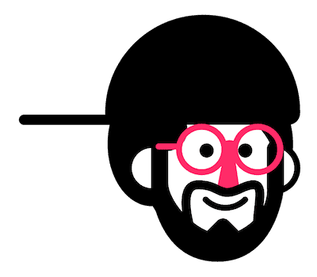

<picture>
  <source media="(prefers-color-scheme: dark)" srcset="docs/.vuepress/public/hero.png">">
  <source media="(prefers-color-scheme: light)" srcset="docs/.vuepress/public/logo.png">">
  
</picture>

> A cozy 😌 collection of free resources for developers and designers curated with ♥️

 

## 🎉

- [x] Animations
- [x] App Dev
- [x] Colors
- [x] Github
- [x] Icons
- [x] Illustrations
- [x] Images
- [x] Learning
- [x] Misc
- [x] Mockups
- [x] Tools
- [x] Typefaces
- [x] Vue
- [x] Web Tools

 

## ⚡

- [Vuepress](https://vuepress.vuejs.org/)
- [Vuepress Theme VT](https://vuepress-theme-vt.vercel.app/)

---

> **Note**  [This version](https://github.com/VedxP/reesors-v1) of Reesors has been deprecated in favor of Reesors-v2 and will no longer be updated. Please visit the [maintained version!](https://github.com/VedxP/reesors)
